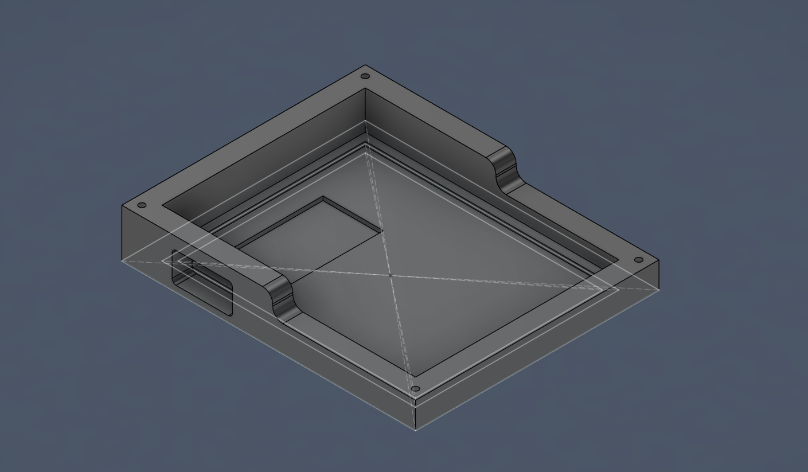
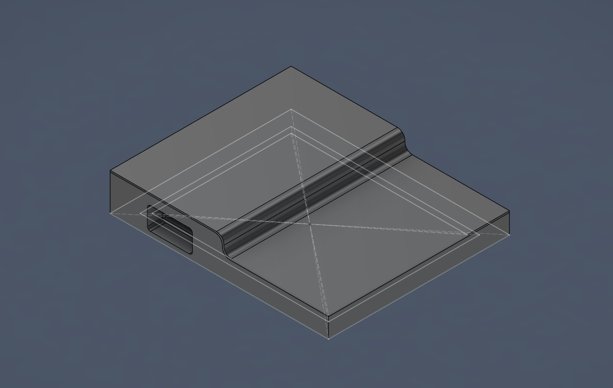
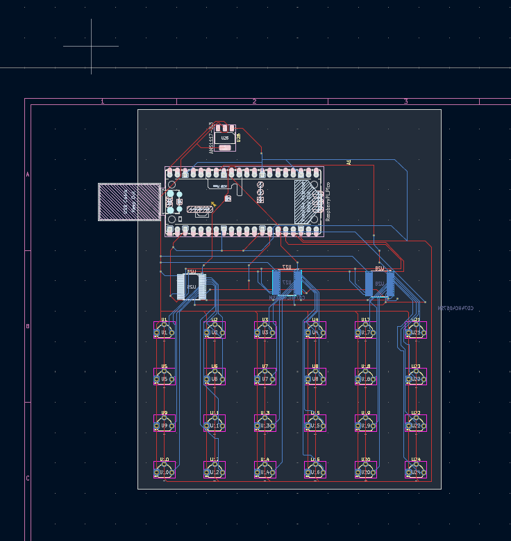
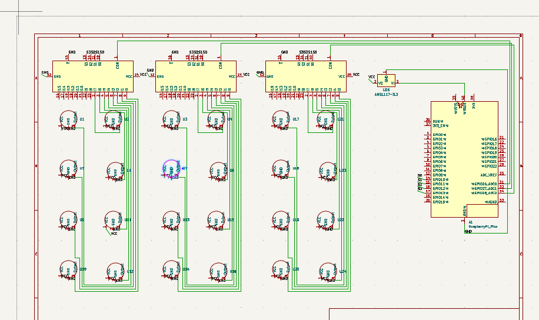

Readme for the halleffectmousepad project.

This project aims to create a mousepad that includes a grid of hall effect sensors to detect magnets. The values of each will be interpreted by a program to calculate the position of the magnet even if it is not on the exact position of a sensor. 

# BOM
 |Part|QTY|
 |---|---|
 |SS49E Hall Effect Sensor|24|
 |CD74HC4067SE analog mux|3|
 |AMS1117-3.3 regulator|1|
 |Neodyum magnets 12mm diameter*2mm|1|
 |0.1 uF capacitor|3|
 |10uF capacitor|2|
 |3D printed case|1|
 |3D printed magnet casing|1|
 |usb cable|1|